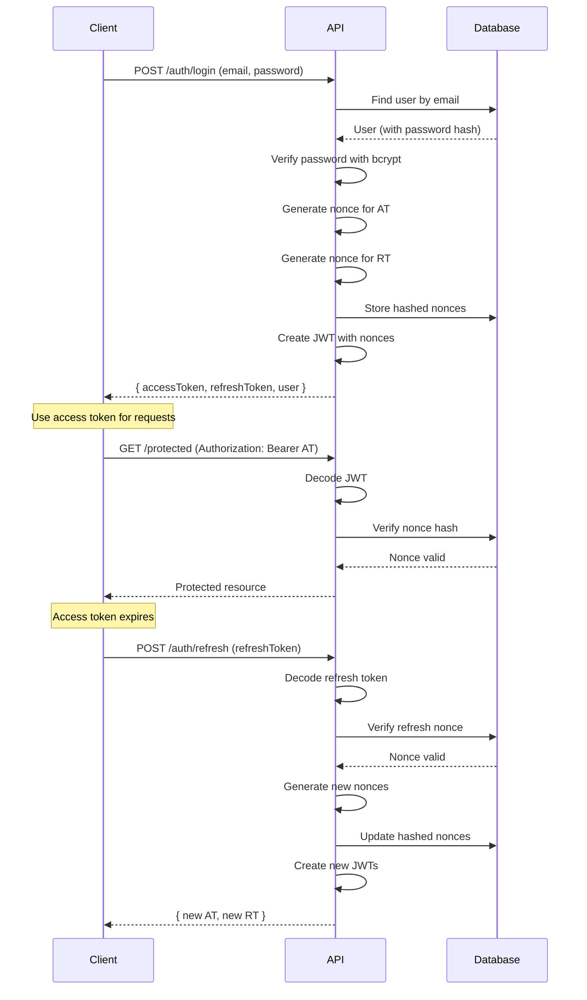

# @nest-util/nest-auth

> A flexible, dynamic NestJS authentication library with JWT support, refresh token rotation, and entity-agnostic design

## Table of Contents

- [Overview](#overview)
- [Installation](#installation)
- [Quick Start](#quick-start)
- [Core Concepts](#core-concepts)
- [Configuration Reference](#configuration-reference)
- [API Reference](#api-reference)
- [Security Architecture](#security-architecture)
- [Advanced Usage](#advanced-usage)
- [Best Practices](#best-practices)
- [Troubleshooting](#troubleshooting)
- [Examples](#examples)

---

## Overview

`@nest-util/nest-auth` provides a complete, production-ready authentication system for NestJS applications without forcing you into a specific user model or database schema. It's designed to be:

- **Entity-Agnostic**: Works with any user entity - no required base class
- **Flexible Field Mapping**: Map authentication fields to your existing schema
- **DTO-First**: Provide your own DTOs for full control over validation and documentation
- **Secure by Default**: Bcrypt hashing, JWT tokens, and refresh token rotation
- **Type-Safe**: Full TypeScript support with proper type inference
- **Easy to Extend**: Override services and strategies for custom logic

### Key Features

✅ **JWT Authentication** - Access and refresh tokens with configurable expiration  
✅ **Refresh Token Rotation** - Single-use tokens with nonce validation  
✅ **Bcrypt Password Hashing** - Secure password storage  
✅ **Custom DTOs** - Full control over validation and Swagger docs  
✅ **Flexible Guards** - `JwtAuthGuard` with `@Public()` decorator support  
✅ **Current User Decorator** - Easy access to authenticated user  
✅ **Route Control** - Enable/disable auth endpoints via configuration  
✅ **No Vendor Lock-in** - No required base classes or interfaces  

---

## Installation

### Prerequisites

- NestJS v10+
- TypeORM v0.3+
- Node.js v18+

### Install the Package

```bash
# Using pnpm (recommended)
pnpm add https://github.com/nigussolomon/nest-util/releases/download/latest/nest-util-nest-auth-0.0.1.tgz

# Using npm
npm install https://github.com/nigussolomon/nest-util/releases/download/latest/nest-util-nest-auth-0.0.1.tgz
```

### Required Peer Dependencies

```bash
pnpm add @nestjs/passport @nestjs/jwt passport passport-jwt bcrypt
pnpm add -D @types/passport-jwt @types/bcrypt
```

---

## Quick Start

### Step 1: Create User Entity

Create a user entity with fields for authentication:

```typescript
// user.entity.ts
import { Entity, PrimaryGeneratedColumn, Column } from 'typeorm';
import { ApiProperty } from '@nestjs/swagger';

@Entity()
export class User {
  @PrimaryGeneratedColumn()
  @ApiProperty()
  id!: number;

  @Column({ unique: true })
  @ApiProperty()
  email!: string;

  @Column({ select: false }) // Hide from default queries
  password!: string;

  @Column({ select: false, nullable: true })
  accessToken?: string;

  @Column({ select: false, nullable: true })
  refreshToken?: string;

  @Column({ default: true })
  @ApiProperty()
  isActive!: boolean;
}
```

> **Note:** The `select: false` option prevents sensitive fields from being returned in queries by default.

### Step 2: Create Authentication DTOs

Define your authentication DTOs with validation and documentation:

```typescript
// auth.dto.ts
import { ApiProperty } from '@nestjs/swagger';
import { IsEmail, IsString, MinLength } from 'class-validator';

export class LoginDto {
  @ApiProperty({ example: 'user@example.com' })
  @IsEmail()
  email!: string;

  @ApiProperty({ example: 'password123' })
  @IsString()
  password!: string;
}

export class RegisterDto {
  @ApiProperty({ example: 'user@example.com' })
  @IsEmail()
  email!: string;

  @ApiProperty({ example: 'password123', minLength: 6 })
  @IsString()
  @MinLength(6)
  password!: string;
}

export class RefreshDto {
  @ApiProperty()
  @IsString()
  refreshToken!: string;
}
```

### Step 3: Register AuthModule

Import and configure the AuthModule in your AppModule:

```typescript
// app.module.ts
import { Module } from '@nestjs/common';
import { TypeOrmModule } from '@nestjs/typeorm';
import { AuthModule } from '@nest-util/nest-auth';
import { User } from './user/user.entity';
import { LoginDto, RegisterDto, RefreshDto } from './auth/auth.dto';

@Module({
  imports: [
    TypeOrmModule.forRoot({ /* your config */ }),
    
    AuthModule.forRoot({
      // Entity configuration
      userEntity: User,
      identifierField: 'email',      // Field used for login (e.g., email, username)
      passkeyField: 'password',       // Field containing hashed password
      
      // Token configuration
      jwtSecret: process.env.JWT_SECRET || 'your-secret-key',
      jwtExpiresIn: '15m',           // Access token lifetime
      refreshTokenExpiresIn: '7d',    // Refresh token lifetime
      
      // Token storage fields
      accessTokenField: 'accessToken',
      refreshTokenField: 'refreshToken',
      
      // DTOs for validation and documentation
      loginDto: LoginDto,
      registerDto: RegisterDto,
      refreshDto: RefreshDto,
      
      // Route configuration (optional)
      enableRegister: true,           // Default: true
      enableLogin: true,              // Default: true
      enableRefresh: true,            // Default: true
      enableProfile: true,            // Default: true
      enableLogout: true,             // Default: true
    }),
  ],
})
export class AppModule {}
```

### Step 4: Protect Routes

Use the `JwtAuthGuard` to protect your endpoints:

```typescript
// profile.controller.ts
import { Controller, Get, UseGuards } from '@nestjs/common';
import { JwtAuthGuard, CurrentUser, AuthUser } from '@nest-util/nest-auth';
import { ApiBearerAuth, ApiTags } from '@nestjs/swagger';

@ApiTags('profile')
@ApiBearerAuth()
@Controller('profile')
@UseGuards(JwtAuthGuard) // Protect all routes in this controller
export class ProfileController {
  
  @Get('me')
  getMyProfile(@CurrentUser() user: AuthUser) {
    return user; // Returns user without sensitive fields
  }

  @Get('settings')
  getSettings(@CurrentUser() user: AuthUser) {
    return {
      userId: user.id,
      email: user[user.identifierField],
    };
  }
}
```

### Step 5: Use Authentication Endpoints

The following endpoints are automatically available:

```bash
# Register a new user
POST /auth/register
Content-Type: application/json
{"email":"user@example.com","password":"password123"}

# Response
{
  "user": { "id": 1, "email": "user@example.com", "isActive": true },
  "accessToken": "eyJhbGc...",
  "refreshToken": "eyJhbGc..."
}

# Login
POST /auth/login
Content-Type: application/json
{"email":"user@example.com","password":"password123"}

# Refresh access token
POST /auth/refresh
Content-Type: application/json
{"refreshToken":"eyJhbGc..."}

# Get current user profile
GET /auth/me
Authorization: Bearer eyJhbGc...

# Logout (invalidate tokens)
POST /auth/logout
Authorization: Bearer eyJhbGc...
```

---

## Core Concepts

### 1. Entity-Agnostic Design

Unlike many auth libraries, nest-auth doesn't require your user entity to extend a base class or implement an interface. You simply configure field mappings:

```typescript
AuthModule.forRoot({
  userEntity: User,
  identifierField: 'email',  // or 'username', 'phone', etc.
  passkeyField: 'password',
  accessTokenField: 'accessToken',
  refreshTokenField: 'refreshToken',
})
```

### 2. DTO Factory Pattern

You provide your own DTOs, giving you full control over:
- Validation rules (class-validator)
- Swagger documentation (ApiProperty)
- Additional fields
- Custom transformation logic

### 3. Secure Token Storage

Tokens are not stored directly. Instead:
1. A unique nonce is generated for each token
2. The nonce is hashed and stored in the database
3. The nonce is included in the JWT payload
4. On validation, the hashed nonce from the database is compared with the nonce in the token

This ensures tokens are single-use and can be invalidated.

### 4. Refresh Token Rotation

When a refresh token is used:
1. The token's nonce is validated against the database
2. A new access token is generated with a new nonce
3. A new refresh token is generated with a new nonce
4. The old tokens are invalidated
5. The new tokens are returned to the client

This prevents token replay attacks.

---

## Configuration Reference

### AuthModuleOptions

Complete configuration options for `AuthModule.forRoot()`:

```typescript
interface AuthModuleOptions {
  // Required: Entity Configuration
  userEntity: Type<any>;                  // Your user entity class
  identifierField: string;                  // Login field (email, username, etc.)
  passkeyField: string;                     // Password field name
  
  // Required: JWT Configuration
  jwtSecret: string;                        // Secret key for signing JWTs
  
  // Optional: Token Expiration
  jwtExpiresIn?: string;                    // Access token TTL (default: '15m')
  refreshTokenExpiresIn?: string;           // Refresh token TTL (default: '7d')
  
  // Required: Token Storage Fields
  accessTokenField: string;                 // Field to store hashed AT nonce
  refreshTokenField: string;                // Field to store hashed RT nonce
  
  // Required: DTOs
  loginDto: Type<any>;                      // DTO for login requests
  registerDto: Type<any>;                   // DTO for registration requests
  refreshDto: Type<any>;                    // DTO for refresh requests
  
  // Optional: Route Control
  enableRegister?: boolean;                 // Enable POST /auth/register (default: true)
  enableLogin?: boolean;                    // Enable POST /auth/login (default: true)
  enableRefresh?: boolean;                  // Enable POST /auth/refresh (default: true)
  enableProfile?: boolean;                  // Enable GET /auth/me (default: true)
  enableLogout?: boolean;                   // Enable POST /auth/logout (default: true)
}
```

### Example Configurations

#### Minimal Configuration

```typescript
AuthModule.forRoot({
  userEntity: User,
  identifierField: 'email',
  passkeyField: 'password',
  jwtSecret: process.env.JWT_SECRET,
  accessTokenField: 'accessToken',
  refreshTokenField: 'refreshToken',
  loginDto: LoginDto,
  registerDto: RegisterDto,
  refreshDto: RefreshDto,
})
```

#### Production Configuration

```typescript
AuthModule.forRoot({
  userEntity: User,
  identifierField: 'email',
  passkeyField: 'password',
  
  // Use environment variables
  jwtSecret: process.env.JWT_SECRET,
  jwtExpiresIn: '15m',                    // Short-lived access tokens
  refreshTokenExpiresIn: '7d',            // Long-lived refresh tokens
  
  accessTokenField: 'accessToken',
  refreshTokenField: 'refreshToken',
  
  loginDto: LoginDto,
  registerDto: RegisterDto,
  refreshDto: RefreshDto,
  
  // Disable registration in production (use admin panel instead)
  enableRegister: false,
})
```

#### Username-Based Authentication

```typescript
AuthModule.forRoot({
  userEntity: User,
  identifierField: 'username',            // Use username instead of email
  passkeyField: 'password',
  jwtSecret: process.env.JWT_SECRET,
  accessTokenField: 'accessToken',
  refreshTokenField: 'refreshToken',
  loginDto: LoginDto,                     // LoginDto should have 'username' field
  registerDto: RegisterDto,
  refreshDto: RefreshDto,
})
```

---

## API Reference

### AuthService

The main service handling authentication logic.

#### register(data: any): Promise<AuthUser>

Register a new user.

**Parameters:**
- `data` - User registration data (matches your RegisterDto)

**Returns:**
- `Promise<AuthUser>` - The created user (without sensitive fields)

**Throws:**
- `ConflictException` - If user already exists

**Example:**
```typescript
const user = await authService.register({
  email: 'user@example.com',
  password: 'password123',
});
```

#### login(identifier: string, passkey: string): Promise<AuthTokens>

Authenticate a user and return tokens.

**Parameters:**
- `identifier` - User's email/username
- `passkey` - User's password

**Returns:**
```typescript
{
  user: AuthUser;
  accessToken: string;
  refreshToken: string;
}
```

**Throws:**
- `UnauthorizedException` - If credentials are invalid

#### refresh(refreshToken: string): Promise<AuthTokens>

Generate new tokens using a refresh token.

**Parameters:**
- `refreshToken` - Valid refresh token

**Returns:**
- New access and refresh tokens

**Throws:**
- `UnauthorizedException` - If token is invalid or expired

#### logout(userId: number): Promise<boolean>

Invalidate user's tokens.

**Parameters:**
- `userId` - ID of the user to logout

**Returns:**
- `true` if successful

#### validate(payload: any): Promise<AuthUser>

Validate a JWT payload (used internally by guards).

**Parameters:**
- `payload` - Decoded JWT payload

**Returns:**
- User object if valid

**Throws:**
- `UnauthorizedException` - If token is invalid

### Guards

#### JwtAuthGuard

Protects routes requiring authentication.

**Usage:**
```typescript
@UseGuards(JwtAuthGuard)
@Get('protected')
protectedRoute() {
  return 'This requires authentication';
}
```

### Decorators

#### @CurrentUser()

Injects the authenticated user into a route handler.

**Usage:**
```typescript
@Get('profile')
@UseGuards(JwtAuthGuard)
getProfile(@CurrentUser() user: AuthUser) {
  return user;
}
```

#### @Public()

Marks a route as public (bypasses JwtAuthGuard).

**Usage:**
```typescript
@Controller('posts')
@UseGuards(JwtAuthGuard) // Protect controller
export class PostsController {
  
  @Public() // This route is public
  @Get()
  findAll() {
    return 'Public route';
  }

  @Get('my-posts') // This route requires authentication
  myPosts(@CurrentUser() user: AuthUser) {
    return 'Private route';
  }
}
```

### Types

#### AuthUser

The user object returned after authentication (sensitive fields excluded).

```typescript
class AuthUser {
  id: number;
  identifierField: string;  // 'email', 'username', etc.
  [key: string]: any;       // Other entity fields
}
```

#### AuthTokens

The response from login/refresh operations.

```typescript
interface AuthTokens {
  user: AuthUser;
  accessToken: string;
  refreshToken: string;
}
```

---

## Security Architecture

### Password Hashing

Passwords are hashed using bcrypt with a salt rounds of 10:

```typescript
const hashedPassword = await bcrypt.hash(password, 10);
```

### Token Security

**Access Token:**
- Short-lived (default: 15 minutes)
- Contains user ID and nonce
- Stored nonce (hashed) in database
- Validated on every request

**Refresh Token:**
- Long-lived (default: 7 days)
- Contains user ID and nonce
- Single-use (invalidated after refresh)
- Stored nonce (hashed) in database

### Token Flow Diagram



### Security Features

1. **No Plain Text Storage** - Passwords and token nonces are always hashed
2. **Single-Use Tokens** - Each token has a unique nonce that's invalidated after use
3. **Automatic Expiration** - Tokens expire after configured time
4. **Select:False Protection** - Sensitive fields excluded from default queries
5. **Bcrypt Hashing** - Industry-standard password hashing
6. **Token Rotation** - New tokens issued on refresh, old ones invalidated

---

## Advanced Usage

### Custom Authentication Service

Extend `AuthService` to add custom logic:

```typescript
import { Injectable } from '@nestjs/common';
import { AuthService } from '@nest-util/nest-auth';

@Injectable()
export class CustomAuthService extends AuthService {
  
  // Override registration to add custom logic
  override async register(data: any) {
    // Custom validation
    if (await this.isEmailBlacklisted(data.email)) {
      throw new BadRequestException('Email domain not allowed');
    }

    // Call parent register
    const user = await super.register(data);

    // Send welcome email
    await this.emailService.sendWelcomeEmail(user.email);

    return user;
  }

  // Override login to add logging
  override async login(identifier: string, passkey: string) {
    const result = await super.login(identifier, passkey);

    // Log successful login
    await this.auditService.logLogin(result.user.id);

    return result;
  }

  // Add custom methods
  async isEmailBlacklisted(email: string): Promise<boolean> {
    const domain = email.split('@')[1];
    return this.blacklistedDomains.includes(domain);
  }
}
```

Then provide your custom service:

```typescript
@Module({
  providers: [
    {
      provide: AuthService,
      useClass: CustomAuthService,
    },
  ],
})
export class AuthOverrideModule {}
```

### Role-Based Access Control

Implement RBAC with a custom guard:

```typescript
// roles.decorator.ts
import { SetMetadata } from '@nestjs/common';

export const ROLES_KEY = 'roles';
export const Roles = (...roles: string[]) => SetMetadata(ROLES_KEY, roles);

// roles.guard.ts
import { Injectable, CanActivate, ExecutionContext } from '@nestjs/common';
import { Reflector } from '@nestjs/core';
import { JwtAuthGuard } from '@nest-util/nest-auth';

@Injectable()
export class RolesGuard extends JwtAuthGuard implements CanActivate {
  constructor(private reflector: Reflector) {
    super();
  }

  async canActivate(context: ExecutionContext): Promise<boolean> {
    // First check JWT
    const isAuthenticated = await super.canActivate(context);
    if (!isAuthenticated) return false;

    // Then check roles
    const requiredRoles = this.reflector.get<string[]>(
      'roles',
      context.getHandler()
    );

    if (!requiredRoles) return true;

    const request = context.switchToHttp().getRequest();
    const user = request.user;

    return requiredRoles.some(role => user.roles?.includes(role));
  }
}

// Usage
@Controller('admin')
@UseGuards(RolesGuard)
export class AdminController {
  
  @Roles('admin')
  @Get('users')
  getAllUsers() {
    return 'Admin only';
  }
}
```

### Multi-Tenant Authentication

Support multiple tenants:

```typescript
// tenant-auth.service.ts
@Injectable()
export class TenantAuthService extends AuthService {
  
  override async login(identifier: string, passkey: string) {
    const user = await this.validateUser(identifier, passkey);

    // Get user's tenant
    const tenant = await this.tenantService.findByUser(user.id);

    // Generate tokens with tenant context
    const tokens = await this.generateTokens(user);

    return {
      ...tokens,
      tenant: {
        id: tenant.id,
        name: tenant.name,
      },
    };
  }
}
```

### Email Verification

Add email verification to registration:

```typescript
@Injectable()
export class EmailVerificationService extends AuthService {
  
  override async register(data: any) {
    // Create user (inactive)
    const user = await super.register({
      ...data,
      isActive: false,
      emailVerified: false,
    });

    // Generate verification token
    const verificationToken = this.generateVerificationToken(user.id);

    // Send verification email
    await this.emailService.sendVerificationEmail(
      user.email,
      verificationToken
    );

    return user;
  }

  async verifyEmail(token: string): Promise<AuthUser> {
    const userId = this.validateVerificationToken(token);
    
    await this.repository.update(userId, {
      isActive: true,
      emailVerified: true,
    });

    return this.repository.findOne({ where: { id: userId } });
  }
}
```

---

## Best Practices

### 1. Use Environment Variables for Secrets

Never hardcode secrets:

```typescript
AuthModule.forRoot({
  jwtSecret: process.env.JWT_SECRET,  // Read from .env
  // ...
})
```

.env file:
```
JWT_SECRET=your-very-long-and-random-secret-key-here
```

### 2. Keep Access Tokens Short-Lived

```typescript
AuthModule.forRoot({
  jwtExpiresIn: '15m',              // 15 minutes
  refreshTokenExpiresIn: '7d',      // 7 days
  // ...
})
```

### 3. Hide Sensitive Fields

Always use `select: false` for sensitive fields:

```typescript
@Column({ select: false })
password!: string;

@Column({ select: false, nullable: true })
refreshToken?: string;
```

### 4. Validate DTOs Properly

Use class-validator decorators:

```typescript
export class RegisterDto {
  @IsEmail()
  @IsNotEmpty()
  email!: string;

  @IsString()
  @MinLength(8)
  @Matches(/^(?=.*[a-z])(?=.*[A-Z])(?=.*\d)/, {
    message: 'Password must contain uppercase, lowercase, and number',
  })
  password!: string;
}
```

### 5. Implement Rate Limiting

Protect auth endpoints from brute force:

```bash
pnpm add @nestjs/throttler
```

```typescript
import { ThrottlerModule } from '@nestjs/throttler';

@Module({
  imports: [
    ThrottlerModule.forRoot({
      ttl: 60,
      limit: 10, // 10 requests per minute
    }),
  ],
})
```

### 6. Log Authentication Events

Track logins, logouts, and failures:

```typescript
override async login(identifier: string, passkey: string) {
  try {
    const result = await super.login(identifier, passkey);
    this.logger.log(`Successful login: ${identifier}`);
    return result;
  } catch (error) {
    this.logger.warn(`Failed login attempt: ${identifier}`);
    throw error;
  }
}
```

### 7. Use HTTPS in Production

Never send tokens over unencrypted connections.

---

## Troubleshooting

### Error: "User entity not found"

Make sure TypeOrm knows about your User entity:

```typescript
TypeOrmModule.forRoot({
  entities: [User], // Add your entity
  // or
  entities: [__dirname + '/**/*.entity{.ts,.js}'],
})
```

### Error: "Cannot read property 'password' of undefined"

The password field is likely excluded from the query. The auth service explicitly selects it, but if you're querying users elsewhere, you need to:

```typescript
const user = await repository.findOne({
  where: { id },
  select: ['id', 'email', 'password'], // Explicitly select password
});
```

### Tokens Not Invalidating on Logout

Ensure you're storing the hashed nonces:

```typescript
AuthModule.forRoot({
  accessTokenField: 'accessToken',    // Must match entity field
  refreshTokenField: 'refreshToken',  // Must match entity field
})
```

### "jwt must be provided" Error

Make sure the token is sent in the Authorization header:

```http
Authorization: Bearer <your-token-here>
```

---

## Examples

### Example 1: Complete Auth Setup

```typescript
// app.module.ts
@Module({
  imports: [
    TypeOrmModule.forRoot({
      type: 'postgres',
      // ... connection options
      entities: [User],
    }),
    AuthModule.forRoot({
      userEntity: User,
      identifierField: 'email',
      passkeyField: 'password',
      jwtSecret: process.env.JWT_SECRET,
      jwtExpiresIn: '15m',
      refreshTokenExpiresIn: '7d',
      accessTokenField: 'accessToken',
      refreshTokenField: 'refreshToken',
      loginDto: LoginDto,
      registerDto: RegisterDto,
      refreshDto: RefreshDto,
    }),
  ],
})
export class AppModule {}
```

### Example 2: Protected Resource Controller

```typescript
@Controller('posts')
@UseGuards(JwtAuthGuard)
@ApiBearerAuth()
export class PostsController {

  @Public()
  @Get()
  findAll() {
    return 'Public: View all posts';
  }

  @Get('my-posts')
  myPosts(@CurrentUser() user: AuthUser) {
    return `Private: Posts by user ${user.id}`;
  }

  @Post()
  create(@CurrentUser() user: AuthUser, @Body() dto: CreatePostDto) {
    return `Creating post for user ${user.id}`;
  }
}
```

---

## Summary

`@nest-util/nest-auth` provides a complete, flexible authentication solution:

✅ **Easy Setup** - Configure in minutes with minimal boilerplate  
✅ **Secure by Default** - Bcrypt, JWT, token rotation, and nonce validation  
✅ **Flexible** - Works with any entity, any schema  
✅ **Type-Safe** - Full TypeScript support  
✅ **Extensible** - Easy to customize and extend  
✅ **Production-Ready** - Battle-tested security patterns  

**Next Steps:**
- [Getting Started Guide](getting-started) - Build your first authenticated app
- [CRUD System](nest-crud) - Combine with CRUD operations
- [Examples](examples) - See more authentication patterns
